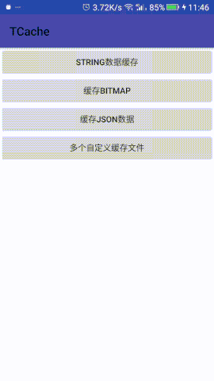

# TCache

TCache是一个封装的Android缓存框架,使用具有很大的灵活性,下面将介绍该框架的使用方法和设计思想  


## TCache使用方法

  获得TCache对象,默认是存储在 **context.getCacheDir()** 的 **tcache** 目录下的.  
  - 可以通过String类型的key缓存你想要缓存的数据,如Bitmap,JSONObject,String,byte[]等等.  
  - 可以获得对应key缓存的数据是否过期
  - 可以清除指定key对应的缓存或清除所有缓存
  - 可以指定自定义的缓存目录,并管理缓存目录中文件的数量和缓存目录的空间.
  - 可以通过自定义的对象字节转换器,缓存你想缓存的对象数据,如Samples中缓存Intent

## TCache获取方法和接口介绍

- 1.获取TCache
``` java
  //通过Context获取对象
  public static TCache get(Context context)
  //通过Context,并指定缓存的根目录
  public static TCache get(Context context, String rootCacheDir)
  //通过Context,并指定缓存的根目录,缓存的相对目录
  public static TCache get(Context context, String rootCacheDir, String relativeCacheDir)
  //通过Context,缓存的根目录,缓存的相对目录,存储目录最多文件数,最大缓存目录空间
  public static TCache get(Context context, String rootCacheDir, String relativeCacheDir,
              int maxDiskTotalCount, int maxDiskTotalSpace)
  //通过Context,缓存的根目录,缓存的相对目录,存储目录最多文件数,最大缓存目录空间,指定缓存默认失效时间
  TCache get(Context context, String rootCacheDir, String relativeCacheDir,
              int maxDiskTotalCount, int maxDiskTotalSpace, int defCacheAge)
```

- 2.TCache提供的缓存数据接口CacheManager,该接口标示这TCache提供了一些缓存数据和获取缓存的方法,如Bitmap,JSONObject等

``` java
interface CacheManager extends Cache {
  //缓存字节数组
  void putBytes(String key, byte[] bytes);
  //获取缓存的字节数组
  byte[] getBytes(String key);
  //缓存Bitmap
  void putBitmap(String key, Bitmap bitmap);
  //获取缓存的Bitmap
  Bitmap getBitmap(String key);
  //缓存序列化对象
  <T extends Serializable> void putSerializable(String key, T obj);
  //获取缓存的序列化对象
  <T extends Serializable> T getSerializable(String key);
  //缓存JSONObject
  void putJSONObject(String key, JSONObject obj);
  //获取缓存的JSONObject
  JSONObject getJSONObject(String key) throws JSONException;
}
```

- 3.CacheManager的父接口Cache,该接口标示了TCache提供的对象字节转换器来缓存任一对象,TCache判读指定缓存是否过期和清除操作

``` java
interface Cache {
    //通过字节转换器缓存对象
    <T> void putByteMapper(String key, T obj, ByteMapper<T> mapper);
    //通过字节转换器获取缓存的对象
    <T> T getByteMapper(String key, ByteMapper<T> mapper);
    //通过默认的有效缓存周期判断指定的对象是否过期
    boolean isExpired(String key);
    //通过指定的的有效缓存周期判断指定的对象是否过期
    boolean isExpired(String key, long age);
    //清除指定的缓存
    void evict(String key);
    //清除所有缓存
    void evictAll();
    //是否有指定key的缓存
    boolean isCached(String key);
}
```

- 4.对象字节转换器接口ByteMapper,通过该接口可以完成任意对象和字节数组的相互转换

``` java
public interface ByteMapper<T> {
    //通过对象获取字节数组
    byte[] getBytes(T obj);
    //通过字节数组获取对象
    T getObject(byte[] bytes);
}
```

## TCache的设计思想

  - 缓存目录管理  
  TCache采用分目录管理的方式管理不同位置的缓存,比如默认的tcache目录,tcache默认的缓存空间是50M,默认的缓存文件数量是500个,生命是不限的.TCache可以同时管理多个相对缓存目录,这些目录和tcache目录的性质是一样的.  
  - 数据如何持久存储  
  TCache会将指定key的数据用一个目录层文件的方式换出起来  
  - 如何缓存任意数据  
  如何缓存任一数据,因为任何数据在计算机上都是以字节的形式存储的,因此TCache设计了字节对象转换器,这样用户就可以自己扩展自己想存储的数据了,比如Samples中的Intent对象.  
  - 写文件  
  TCache采用nio的方式进行读写文件,比寻常的io stream更高效.    
  - 二级缓存  
  为了提高缓存的读取效率,设计了二级缓存,将暂时使用的缓存数据会缓存到内存中.  
  - 缓存过期机制  
  如上所述,每个key对应的数据就是一个文件,那么这个数据文件的last modified time就是文件最后的缓存时间,TCache会修改该缓存文件对应父目录的last modified time时间,TCache会根据这个时间去判读是否过期,比如缓存了一个key为"xxx/yyy/zzz"的数据"ABCD",也可以获得key"xxx"的缓存是否过期,这样可以对相同类型的数据进行用户指定的缓存过期判断.  
  - 缓存清除  
  同上的过期机制,缓存清除一个清除指定的目录或文件  
  - 线程控制  
  因为缓存数据到disk上是通常的IO操作,所以TCache在put时对线程进行判断,防止在主线程进行Cache操作.
  
## TCache总结
  TCache是一个方便缓存数据的实用框架,便于扩展;但也有不足,欢迎大家提出[issues](https://github.com/borneywpf/TCache/issues)指正交流,不胜感激!!!
